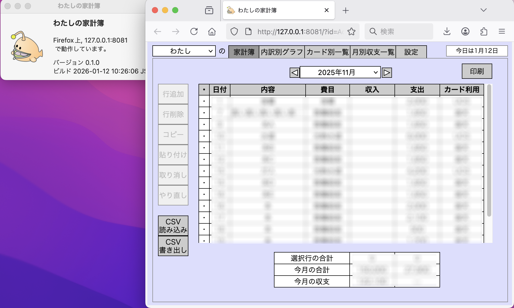
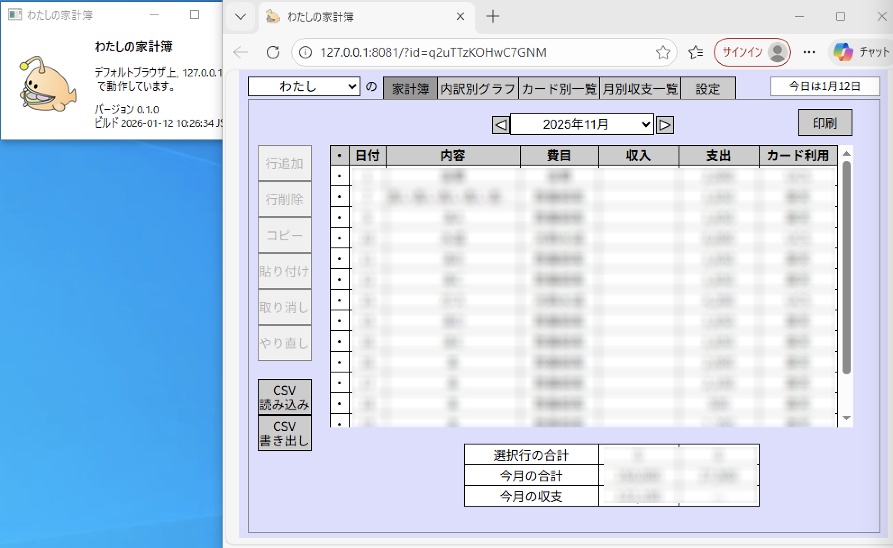
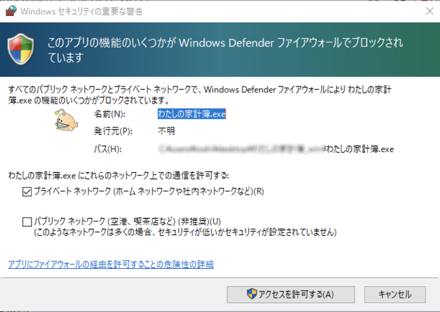

#  Watashi-no-Kakeibo (わたしの家計簿): household account book of mine

  Toshi Nagata

  2026/01/12 Version 0.1.0

##  これは何？

PC (Mac, Windows) 用の家計簿アプリです。ブラウザ上で動いていますが、データはすべてローカルに保存され、ネットとの通信は行いません。

アプリの仕様は、かつて金融広報中央委員会が開発・配布していた「みんなの家計簿」に寄せてあります。

##  使い方

*  アプリ本体をダウンロードして、適当なフォルダに入れてください。
•  Mac 版はアプリ本体、Windows 版は展開後のフォルダ内の「わたしの家計簿」アプリをダブルクリックで開いてください。
*  「ファイアウォールでブロックされています」という警告が出た場合は、「プライベートネットワーク」を許可してください。

* ブラウザが立ち上がります。ブラウザのウィンドウを閉じると、本体は自動的に終了します。先に本体を終了してもブラウザのウィンドウは閉じないので、その場合は手動で閉じてください。
* ブラウザのウィンドウを閉じる時に「データが失われる可能性があります」と警告が出ますが、データは常に保存されているので、構わず閉じていただいて結構です。
* データは、ホームフォルダにある kakeibo フォルダの中に入っています。単純なCSVファイルです。このフォルダのバックアップをとっておけば、データが壊れた時も復旧できます。古いデータをある程度残しておく仕様になっているので、必要な時は手動で復旧してください。

##  技術仕様

* フロントエンド (GUI) は Vue.js/TypeScript で書かれています。
* もともと、Tauri を使って単独アプリにする予定でしたが、古い OS で動作させるため、バックエンドをwxWidgetsとC++で別途開発しました。Tauri 用のコードも残してあるので、Tauri でアプリ化することも可能なはずです。
* まだ「とりあえず動いた」レベルです。セキュリティ上の問題などがあるかもしれません。ご利用は自己責任でお願いします。

##  ライセンス

GPL3 です。(https://www.gnu.org/licenses/gpl-3.0.html)

##  使用しているライブラリ

* wxWidgets (https://wxwidgets.org/)
* Vue.js (https://vuejs.org/)
* Tauri (https://v2.tauri.app/)
* cpp-httplib (https://github.com/yhirose/cpp-httplib)
* nlohmann JSON Library (https://github.com/nlohmann/json)

##  作者について

Toshi Nagata (https://d-alchemy.xyz/blog/)
