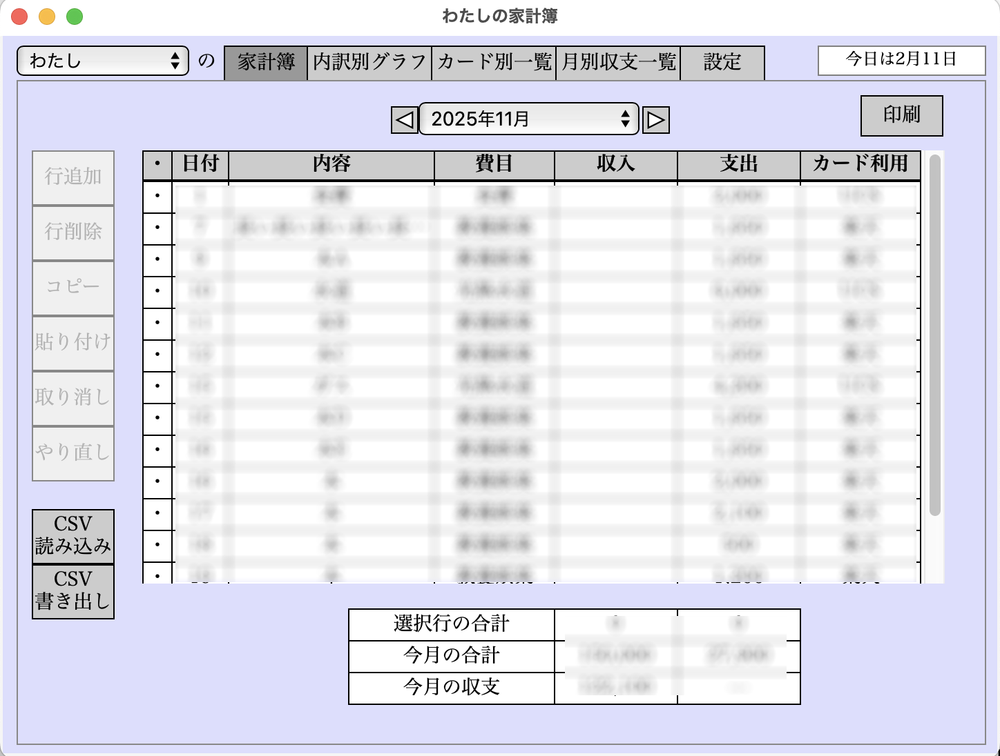
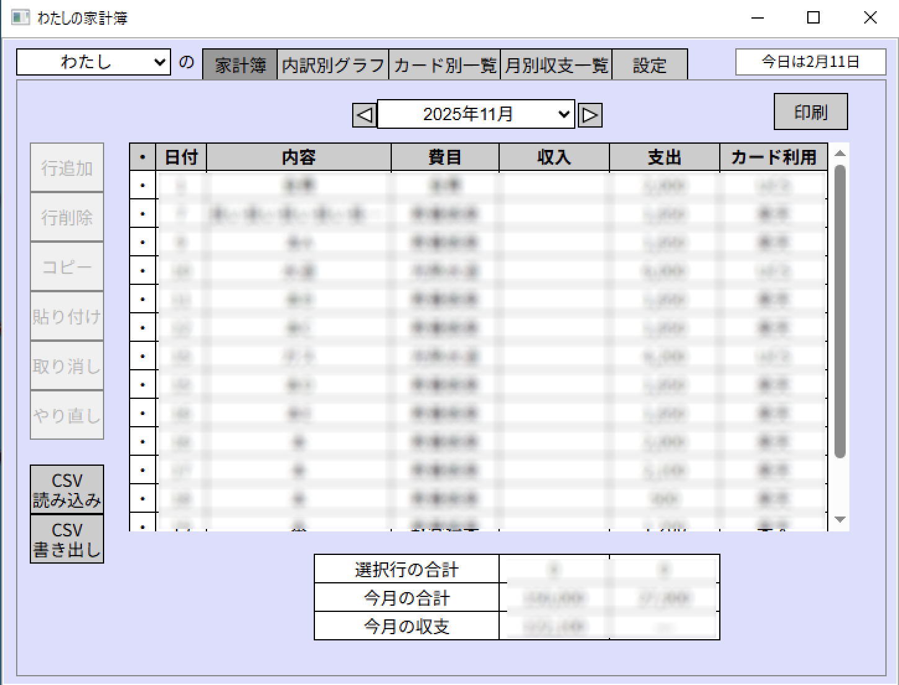

#  Watashi-no-Kakeibo (わたしの家計簿): household account book of mine

  Toshi Nagata

  2026/02/11 Version 0.2.0

##  これは何？

PC (Mac, Windows) 用の家計簿アプリです。ブラウザ上で動いていますが、データはすべてローカルに保存され、ネットとの通信は行いません。

アプリの仕様は、かつて金融広報中央委員会が開発・配布していた「みんなの家計簿」に寄せてあります。

##  使い方

*  アプリ本体をダウンロードして、適当なフォルダに入れてください。
*  Mac 版はアプリ本体、Windows 版は展開後のフォルダ内の「わたしの家計簿」アプリをダブルクリックで開いてください。
*  「ファイアウォールでブロックされています」という警告が出た場合は、「プライベートネットワーク」を許可してください。ただし、ネットワーク通信はPC内部でのみ行っており、外との通信は行いません。

* データは、ホームフォルダにある kakeibo フォルダの中に入っています。単純なCSVファイルです。このフォルダのバックアップをとっておけば、データが壊れた時も復旧できます。古いデータをある程度残しておく仕様になっているので、必要な時は手動で復旧してください。

* MacOS 11 以前、Windows 10 以前で WebView2 がインストールされていない場合は、ブラウザ上で動作します。
* ブラウザ上で動作している場合、ブラウザのウィンドウを閉じると、本体は自動的に終了します。また、逆に先に本体を終了すると、ブラウザのウィンドウ上で「アプリ本体が閉じられました。このタブを閉じてください。」とメッセージがでるので、タブを閉じてください。

##  技術仕様

* フロントエンド (GUI) は Vue.js/TypeScript で書かれています。
* 古い OS で動作させるため、バックエンドをwxWidgetsとC++で書いています。ただし、WebViewのバージョンが古い場合は、ブラウザ上での動作に切り替えます。
* まだ「とりあえず動いた」レベルです。セキュリティ上の問題などがあるかもしれません。ご利用は自己責任でお願いします。

##  ライセンス

GPL3 です。(https://www.gnu.org/licenses/gpl-3.0.html)

##  使用しているライブラリ

* wxWidgets (https://wxwidgets.org/)
* Vue.js (https://vuejs.org/)
* Mongoose (https://mongoose.ws/)
* nlohmann JSON Library (https://github.com/nlohmann/json)

##  作者について

Toshi Nagata (https://d-alchemy.xyz/blog/)
